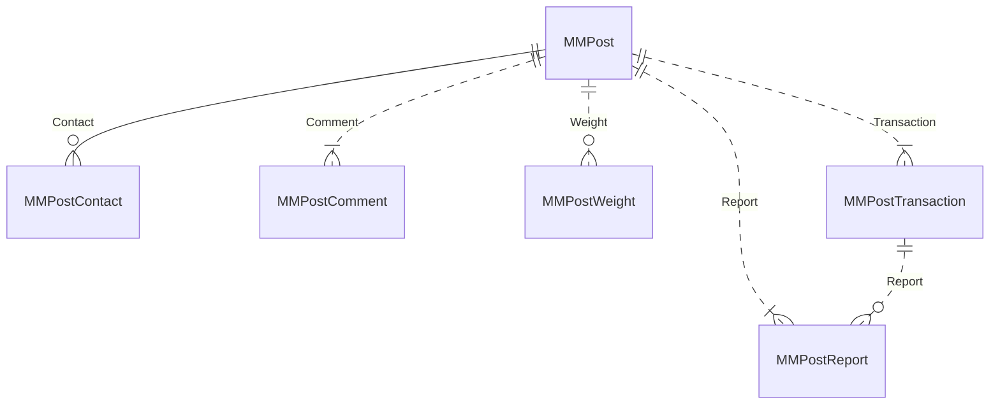
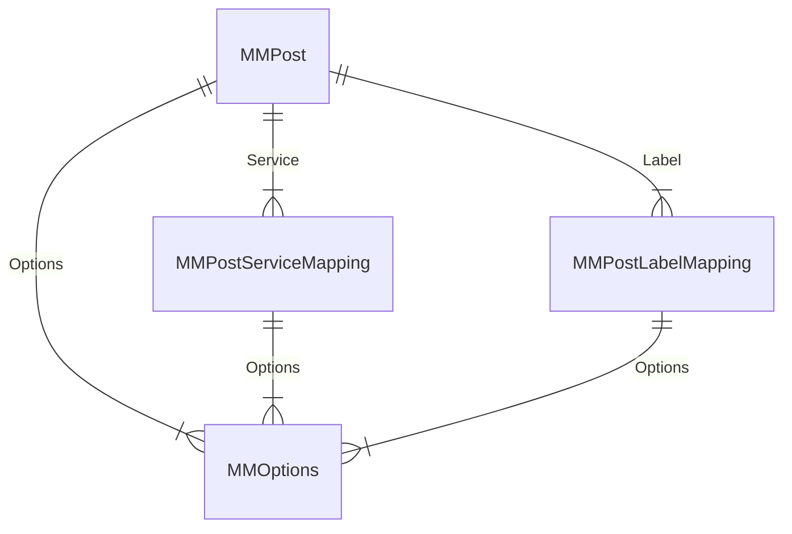
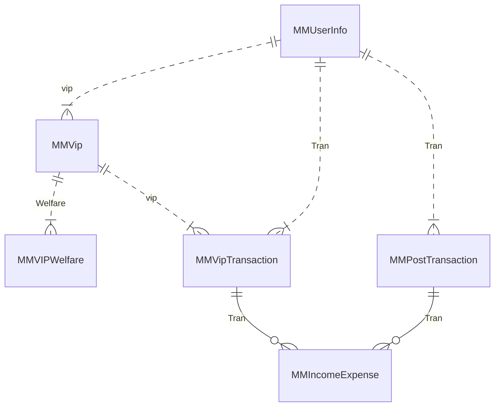
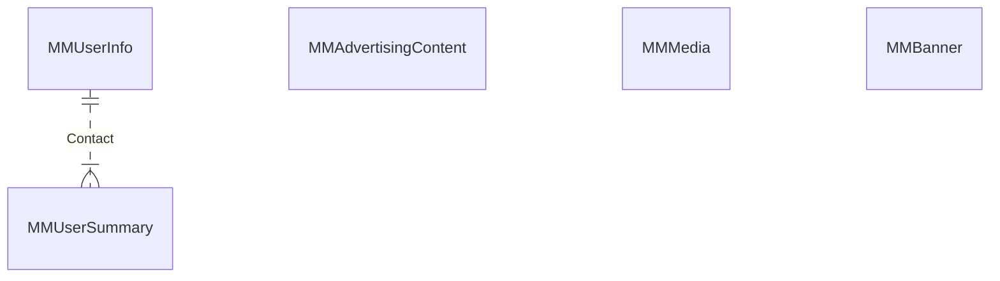

# Table

| Table Name | 說明 |
| ---------- | ---- |
|MMUserInfo|用戶資訊|
|MMUserSummary|用戶摘要|
|MMVip|會員卡|
|MMVIPWelfare|會員卡福利(免費解鎖點數、折扣)|
|MMVipTransaction|會員卡交易|
|MMPost|帖子|
|MMPostLabelMapping|標籤|
|MMPostServiceMapping|服務|
|MMPostWeight|權重|
|MMPostComment|評論|
|MMPostReport|舉報|
|MMPostContact|聯絡|
|MMPostTransaction|解鎖|
|MMOptions|下拉選單|
|MMAdvertisingContent|文宣|
|MMIncomeExpense|收益|
|MMMedia|媒體檔案|
|MMBanner|公告|

# 帖子相關

# 帖子相關 - 下拉選單

# 交易相關

# 其他

| name                 | ColumnName         | DataType  | Nullable | Description                                                  |
| -------------------- | ------------------ | --------- | -------- | ------------------------------------------------------------ |
| MMVipTransaction     | VipId              | tinyint   | No       | 會員類型(鑽石、白金、黃金)                                   |
| MMVipTransaction     | UserId             | int       | No       | 付費用戶Id                                                   |
| MMVipTransaction     | CreateTime         | datetime2 | No       | 消費時間                                                     |
| MMVipTransaction     | EffectiveTime      | datetime2 | Yes      | 期限                                                         |
| MMVipTransaction     | Amount             | decimal   | No       | 消費金額                                                     |
| MMVipTransaction     | PayType            | tinyint   | No       | 支付方式                                                     |
| MMVipTransaction     | VipName            | nvarchar  | No       | 會員卡名稱                                                   |
| MMVipTransaction     | Type               | tinyint   | No       | 類型(廣場、官方...)                                          |
| MMAdvertisingContent | Id                 | int       | No       | Id                                                           |
| MMAdvertisingContent | AdvertisingType    | tinyint   | No       | 廣告類型。1：什么是XX、2 : 如何发XX帖。                      |
| MMAdvertisingContent | AdvertisingContent | nvarchar  | No       | 廣告内文                                                     |
| MMAdvertisingContent | PostType           | tinyint   | No       | 帖子類型。1：廣場、2：中介、3：官方、4：體驗                 |
| MMAdvertisingContent | CreateDate         | datetime  | No       | 創建時間                                                     |
| MMAdvertisingContent | ModifyDate         | datetime  | Yes      | 修改時間                                                     |
| MMAdvertisingContent | CreateUser         | nvarchar  | No       | 創建使用者                                                   |
| MMAdvertisingContent | IsActive           | bit       | No       | 是否提供使用者觀看                                           |
| MMPostTransaction    | Id                 | varchar   | No       | 帖子交易Id                                                   |
| MMPostTransaction    | PostId             | varchar   | No       | 帖子Id                                                       |
| MMPostTransaction    | PostType           | tinyint   | No       | 帖子Type                                                     |
| MMPostTransaction    | UserId             | int       | No       | 付費用戶Id                                                   |
| MMPostTransaction    | CreateTime         | datetime2 | No       | 消費時間                                                     |
| MMPostTransaction    | ReportId           | varchar   | Yes      | 投訴單Id                                                     |
| MMOptions            | OptionId           | int       | No       | 選項Id                                                       |
| MMOptions            | OptionContent      | nvarchar  | No       | 選項內文                                                     |
| MMOptions            | OptionType         | tinyint   | No       | 選項類型。1：信息类型、2：申请调价、3：标签、4：服务项目     |
| MMOptions            | PostType           | tinyint   | No       | 帖子類型。1：廣場、2：中介、3：官方、4：體驗                 |
| MMOptions            | CreateDate         | datetime  | No       | 創建時間                                                     |
| MMOptions            | ModifyDate         | datetime  | Yes      | 修改時間                                                     |
| MMOptions            | CreateUser         | nvarchar  | No       | 創建使用者                                                   |
| MMOptions            | IsActive           | bit       | No       | 是否提供使用者觀看                                           |
| MMIncomeExpense      | TransactionType    | tinyint   | No       | 交易類型(收入/支出)                                          |
| MMIncomeExpense      | Category           | tinyint   | No       | 類型(帖子、購買會員)                                         |
| MMIncomeExpense      | SourceId           | varchar   | No       | 來源Id                                                       |
| MMIncomeExpense      | TargetId           | varchar   | Yes      | 目標 ID (支出單、收益單)                                     |
| MMIncomeExpense      | UserId             | int       | No       | 會員Id                                                       |
| MMIncomeExpense      | Title              | nvarchar  | Yes      | 名稱                                                         |
| MMIncomeExpense      | Memo               | nvarchar  | Yes      | 備註                                                         |
| MMIncomeExpense      | Amount             | decimal   | No       | 金額                                                         |
| MMIncomeExpense      | Status             | tinyint   | No       | 狀態                                                         |
| MMIncomeExpense      | CreateTime         | datetime2 | No       | 新增時間                                                     |
| MMIncomeExpense      | DistributeTime     | datetime2 | Yes      | 派發時間                                                     |
| MMIncomeExpense      | PayType            | tinyint   | No       | 點數類型(鑽石、現金)                                         |
| MMIncomeExpense      | Rebate             | decimal   | No       | 折扣/抽成                                                    |
| MMUserInfo           | UserId             | int       | No       | 用戶 Id                                                      |
| MMUserInfo           | Nickname           | nvarchar  | No       | 暱稱                                                         |
| MMUserInfo           | AvatarUrl          | nvarchar  | No       | 頭像                                                         |
| MMUserInfo           | UserIdentity       | tinyint   | No       | 用戶身份                                                     |
| MMUserInfo           | UserLevel          | tinyint   | No       | 用戶等級                                                     |
| MMUserInfo           | RewardsPoint       | int       | No       | 積分                                                         |
| MMUserInfo           | CreateTime         | datetime  | No       | 建立時間                                                     |
| MMUserInfo           | UpdateTime         | datetime  | Yes      | 更新時間                                                     |
| MMUserInfo           | RegisterTime       | datetime  | Yes      | 註冊時間                                                     |
| MMPostContact        | PostId             | varchar   | No       | 帖子 id                                                      |
| MMPostContact        | ContactType        | tinyint   | No       | 聯絡方式。1：微信、2：QQ、3：手機號                          |
| MMPostContact        | Contact            | nvarchar  | No       | 聯繫方式                                                     |
| MMUserSummary        | UserId             | int       | No       | 玩家ID                                                       |
| MMUserSummary        | Category           | tinyint   | No       | 類別(廣場、中介、官方)                                       |
| MMUserSummary        | Type               | tinyint   | No       | 種類(發帖數、解鎖數)                                         |
| MMUserSummary        | Amount             | decimal   | No       | 數量                                                         |
| MMPostWeight         | Id                 | int       | No       | 流水號                                                       |
| MMPostWeight         | PostId             | varchar   | No       | 帖子id                                                       |
| MMPostWeight         | Weight             | int       | No       | 權重                                                         |
| MMPostWeight         | Operator           | nvarchar  | No       | 操作人員                                                     |
| MMPostWeight         | CreateTime         | datetime  | No       | 建立時間                                                     |
| MMVIPWelfare         | Id                 | int       | No       | VIP Welfare Id                                               |
| MMVIPWelfare         | VipId              | int       | No       | VIP Id                                                       |
| MMVIPWelfare         | Type               | tinyint   | No       | 種類                                                         |
| MMVIPWelfare         | Value              | decimal   | No       | 值                                                           |
| MMVIPWelfare         | Memo               | nvarchar  | Yes      | 備註                                                         |
| MMPostLabelMapping   | PostId             | varchar   | No       | 帖子 Id                                                      |
| MMPostLabelMapping   | LabelId            | int       | No       | 標簽 Id                                                      |
| MMPostServiceMapping | PostId             | varchar   | No       | 帖子 Id                                                      |
| MMPostServiceMapping | ServiceId          | int       | No       | 服務Id                                                       |
| MMVip                | Id                 | int       | No       | VIP Id                                                       |
| MMVip                | Name               | nvarchar  | No       | 名稱                                                         |
| MMVip                | Type               | tinyint   | No       | 類型(廣場、官方...)                                          |
| MMVip                | Price              | decimal   | No       | 售價                                                         |
| MMVip                | Status             | tinyint   | No       | 狀態(上架、下架、刪除)                                       |
| MMVip                | Memo               | nvarchar  | Yes      | 備註                                                         |
| MMVip                | CreateUser         | nvarchar  | No       | 新增人                                                       |
| MMVip                | CreateTime         | datetime2 | No       | 新增時間                                                     |
| MMVip                | UpdateUser         | nvarchar  | No       | 更新人                                                       |
| MMVip                | UpdateTime         | datetime2 | No       | 更新時間                                                     |
| MMVip                | Days               | int       | No       | 會員天數                                                     |
| MMPostComment        | CommentId          | varchar   | No       | 評論 Id                                                      |
| MMPostComment        | PostId             | varchar   | No       | 帖子 Id                                                      |
| MMPostComment        | PostType           | tinyint   | No       | 帖子類型。1：廣場、2：中介、3：官方、4：體驗                 |
| MMPostComment        | AvatarUrl          | nvarchar  | Yes      | 發評論當下頭像                                               |
| MMPostComment        | UserId             | int       | No       | 評論人 Id                                                    |
| MMPostComment        | Nickname           | nvarchar  | No       | 評論當下暱稱                                                 |
| MMPostComment        | AreaCode           | varchar   | No       | 區域代碼                                                     |
| MMPostComment        | Status             | tinyint   | No       | 評論狀態。0：審核中、1：已評論(通過)、2：審核不通過          |
| MMPostComment        | Comment            | nvarchar  | No       | 評論內容                                                     |
| MMPostComment        | SpentTime          | datetime  | No       | 消費時間                                                     |
| MMPostComment        | CreateTime         | datetime  | No       | 建立時間                                                     |
| MMPostComment        | UpdateTime         | datetime  | Yes      | 更新時間                                                     |
| MMPostComment        | ExamineMan         | nvarchar  | Yes      | 審核人                                                       |
| MMPostComment        | ExamineTime        | datetime  | Yes      | 審核時間                                                     |
| MMPostComment        | Memo               | nvarchar  | Yes      | 審核未通過原因                                               |
| MMPostFavorite       | FavoriteId         | varchar   | No       | 收藏Id                                                       |
| MMPostFavorite       | PostId             | varchar   | No       | 帖子 id                                                      |
| MMPostFavorite       | UserId             | int       | No       | 用戶id                                                       |
| MMPostFavorite       | CreateTime         | datetime  | No       | 收藏時間                                                     |
| MMPostReport         | ReportId           | varchar   | No       | 舉報 Id                                                      |
| MMPostReport         | ReportType         | tinyint   | No       | 舉報原因。0：騙子、1：廣告騷擾、2：貨不對版、3：無效聯絡方式 |
| MMPostReport         | ComplainantUserId  | int       | No       | 投訴人 UserId                                                |
| MMPostReport         | PostTranId         | varchar   | No       | 關聯解鎖單的id                                               |
| MMPostReport         | PostId             | varchar   | No       | 被檢舉的帖子 Id                                              |
| MMPostReport         | PostType           | tinyint   | No       | 帖子類型。1：廣場、2：中介、3：官方、4：體驗                 |
| MMPostReport         | Status             | tinyint   | No       | 狀態。0：審核中、1：審核通過、2：未通過                      |
| MMPostReport         | Describe           | nvarchar  | No       | 舉報內容                                                     |
| MMPostReport         | CreateTime         | datetime  | No       | 檢舉時間                                                     |
| MMPostReport         | UpdateTime         | datetime  | Yes      | 更新時間                                                     |
| MMPostReport         | ExamineMan         | nvarchar  | Yes      | 審核人                                                       |
| MMPostReport         | ExamineTime        | datetime  | Yes      | 審核時間                                                     |
| MMPostReport         | Memo               | nvarchar  | Yes      | 備註                                                         |
| MMMedia              | Id                 | varchar   | No       | 流水編號                                                     |
| MMMedia              | FileUrl            | nvarchar  | No       | 雲倉儲檔案路徑                                               |
| MMMedia              | MediaType          | tinyint   | No       | 媒體類型 0:圖片, 1:影片                                      |
| MMMedia              | SourceType         | tinyint   | No       | 媒體的來源 0:Banner, 1:帖子, 2:舉報, 3: 評論,                |
| MMMedia              | RefId              | varchar   | Yes      | 對應的編號                                                   |
| MMMedia              | CreateDate         | datetime  | No       | 上傳的時間                                                   |
| MMMedia              | ModifyDate         | datetime  | Yes      | 更改的時間                                                   |
| MMPost               | PostId             | varchar   | No       | Id                                                           |
| MMPost               | PostType           | tinyint   | No       | 帖子類型。1：廣場、2：中介、3：官方、4：體驗                 |
| MMPost               | CoverUrl           | nvarchar  | Yes      | 封面照片                                                     |
| MMPost               | UserId             | int       | No       | 發帖人 Id                                                    |
| MMPost               | Nickname           | nvarchar  | No       | 發帖人當下暱稱                                               |
| MMPost               | Status             | tinyint   | No       | 狀態。0：審核中、1：審核通過、2：未通過                      |
| MMPost               | AppointmentCount   | int       | No       | 預約次數                                                     |
| MMPost               | MessageId          | int       | No       | 信息類型                                                     |
| MMPost               | UnlockAmount       | decimal   | No       | 解鎖價格                                                     |
| MMPost               | ApplyAmount        | decimal   | No       | 申請解鎖價格                                                 |
| MMPost               | ApplyAdjustPrice   | bit       | No       | 申請調價                                                     |
| MMPost               | Title              | nvarchar  | No       | 信息標題                                                     |
| MMPost               | AreaCode           | varchar   | No       | 地區代碼                                                     |
| MMPost               | Quantity           | nvarchar  | No       | 數量                                                         |
| MMPost               | Age                | nvarchar  | No       | 年齡(歲)                                                     |
| MMPost               | Height             | nvarchar  | No       | 身高(cm)                                                     |
| MMPost               | Cup                | nvarchar  | No       | 罩杯                                                         |
| MMPost               | BusinessHours      | nvarchar  | No       | 營業時間                                                     |
| MMPost               | LowPrice           | nvarchar  | No       | 最低價格                                                     |
| MMPost               | HighPrice          | nvarchar  | No       | 最高價格                                                     |
| MMPost               | Address            | nvarchar  | No       | 詳細地址                                                     |
| MMPost               | ServiceDescribe    | nvarchar  | Yes      | 服務描述                                                     |
| MMPost               | Favorites          | int       | No       | 收藏數                                                       |
| MMPost               | Comments           | bigint    | No       | 評論數                                                       |
| MMPost               | Views              | bigint    | No       | 觀看數                                                       |
| MMPost               | UnlockCount        | int       | No       | 解鎖次數                                                     |
| MMPost               | Heat               | int       | Yes      | 熱度                                                         |
| MMPost               | IsFeatured         | bit       | Yes      | 是否精選                                                     |
| MMPost               | CreateTime         | datetime  | No       | 建帖時間                                                     |
| MMPost               | UpdateTime         | datetime  | Yes      | 更新時間                                                     |
| MMPost               | ExamineMan         | nvarchar  | Yes      | 審核人                                                       |
| MMPost               | ExamineTime        | datetime  | Yes      | 審核時間                                                     |
| MMPost               | Memo               | nvarchar  | Yes      | 審核未通過原因                                               |
| MMPost               | OldViewData        | nvarchar  | Yes      | 編輯且在審核中的時候，前端顯示舊編輯資料                     |
| MMBanner             | Id                 | varchar   | No       | 流水號                                                       |
| MMBanner             | Title              | nvarchar  | No       | 標題                                                         |
| MMBanner             | Sort               | int       | No       | 排序                                                         |
| MMBanner             | CreateDate         | datetime  | No       | 創建時間                                                     |
| MMBanner             | StartDate          | datetime  | No       | 開始時間                                                     |
| MMBanner             | EndDate            | datetime  | No       | 結束時間                                                     |
| MMBanner             | ModifyDate         | datetime  | Yes      | 修改時間                                                     |
| MMBanner             | CreateUser         | nvarchar  | No       | 創建使用者                                                   |
| MMBanner             | IsActive           | bit       | No       | 是否提供使用者觀看                                           |
| MMBanner             | ModifyUser         | nvarchar  | Yes      | 修改的使用者                                                 |
| MMBanner             | Type               | tinyint   | No       | 廣告類型                                                     |
| MMBanner             | LinkType           | tinyint   | No       | 連結方式                                                     |
| MMBanner             | RedirectUrl        | nvarchar  | No       | 轉導網址                                                     |