# 秘色架構


<div style="break-after: page; page-break-after: always;"></div>

# 前端與Api之間的溝通

<div style="break-after: page; page-break-after: always;"></div>

## JWT Access Token

Web 與 MMService 之間的溝通透過 JWT Access Token 來驗證請求的合法性，所以每個請求都需要帶入 JWT Access Token，以下為 JWT Access Token 的請求流程。

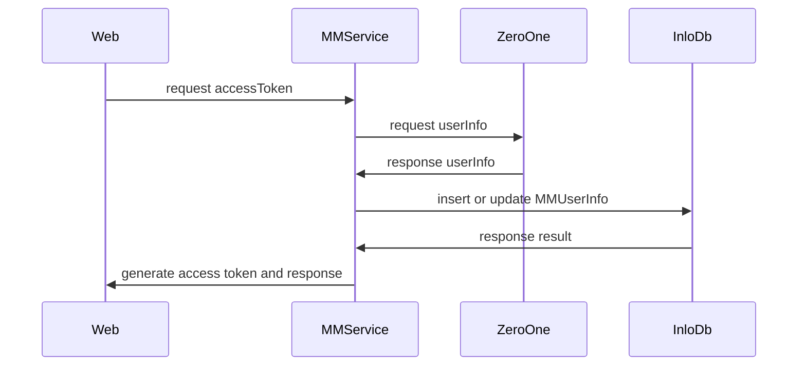
<div style="break-after: page; page-break-after: always;"></div>


## 取得 Banner 列表 

MMBanner 存放 Banner 的資訊例如 Banner 的標題以及轉導 Url 。
MMMedia 存放媒體資訊例如 圖片的 Url 。
服務的處理中再將資料庫的 Url 以及設定檔的Domain轉換成完整的 Url 讓前端取的圖片網址並呈現。
Banner 列表有經過 Redis 快取，所以過程中換先檢查快取中是否有資料，如果沒有會由資料庫取得資料並放置到快取中，當後台異動時會去刪除快取得資料待後續有使用者請求列表時會在去資料庫中取得更新後的資料放到快取中。 

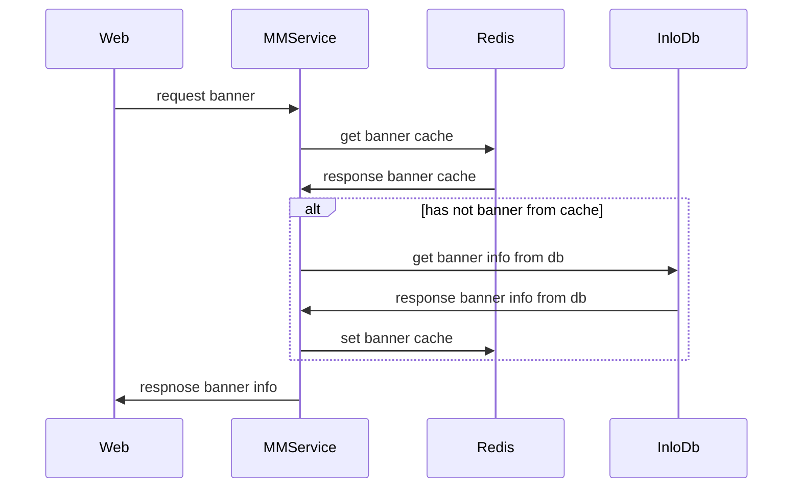
<div style="break-after: page; page-break-after: always;"></div>

## 個人中心

個人中心的處理比較偏向資料蒐集，例如由01那取得密色註冊資料，從 InloDb 取得使用者資料、統計數據、個人營收資訊。

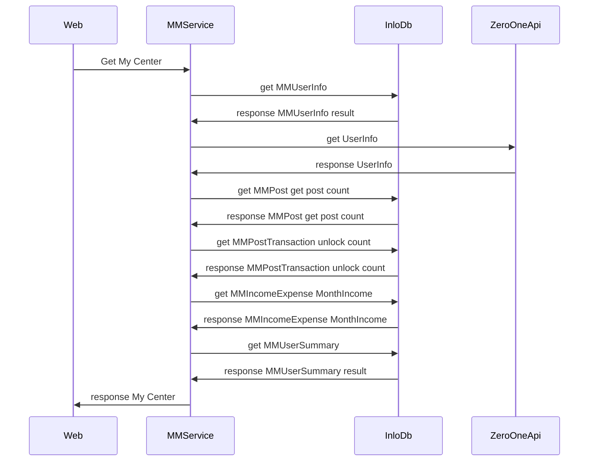
<div style="break-after: page; page-break-after: always;"></div>

## 總覽

總覽位於個人中心內的我的發布之中，主要內容類似個人中心的數據，所以會去MMUserSummery中取的統計資料。

```c#
    public enum UserSummaryTypeEnum
    {
        /// <summary>
        /// 發帖次數
        /// </summary>
        Send = 1,
        /// <summary>
        /// 解鎖帖次數
        /// </summary>
        UnLock = 2,
        /// <summary>
        /// 免費解鎖廣場帖次數
        /// </summary>
        FreeUnlock = 3,
        /// <summary>
        /// 被解鎖次數
        /// </summary>
        Unlocked = 4,
        /// <summary>
        /// 評論次數
        /// </summary>
        Comment = 5,
        /// <summary>
        /// 累積收益(已領取)
        /// </summary>
        Income = 6,
    }
```


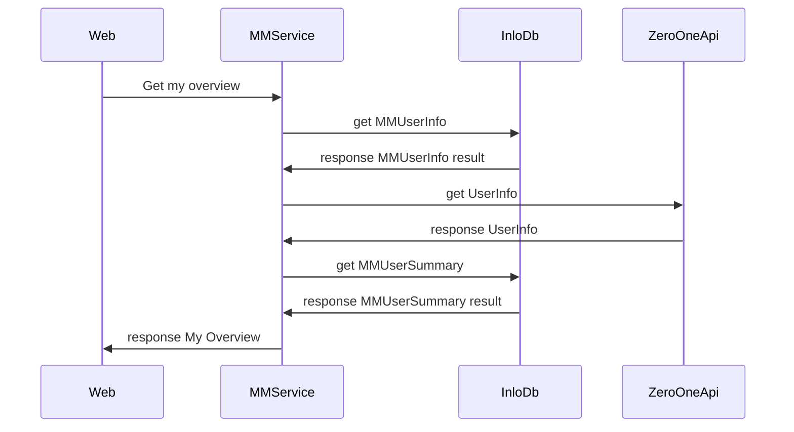
<div style="break-after: page; page-break-after: always;"></div>

## 已解鎖


已解鎖放在 MMPostTransaction 之中，其中會有關連到對應的帖子編號、在產生我的解鎖時同時會有收益支出資料放在 MMIncomeExpense ，另外有一隻排成會再到期時檢視獲得收益方的會員會員卡資訊，來派發收益給發帖的會員。所以收益支出資料中記載對應的資料編號在 TargetId ，而解鎖卡的編號會記錄在 SourceId之中。

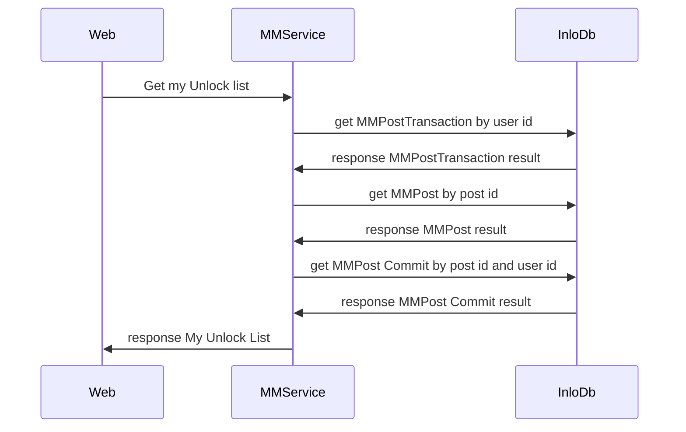
<div style="break-after: page; page-break-after: always;"></div>

## 發帖管理

這裡放著使用者的發帖列表資訊，其中 CoverUrl 存放著第一章貼圖的相對位址，所以在獲取列表之訊時要由設定檔中取的Domain資訊組成完整的圖片位址。

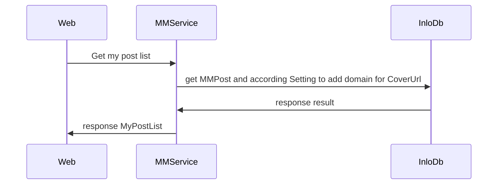
<div style="break-after: page; page-break-after: always;"></div>

## 取得帖子

前端提交取得帖子列表的請求，其中`isRecommend`代表是否為後台設定的推薦資訊。

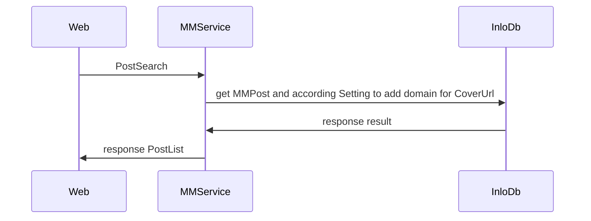


<div style="break-after: page; page-break-after: always;"></div>

## 覓帖詳情

透過提交帖子編號來取得對應帖子得詳細資料，例如帖子資訊以及附圖資訊。

在收到帖子詳細資料後會在取得對應該帖子得評論列表。

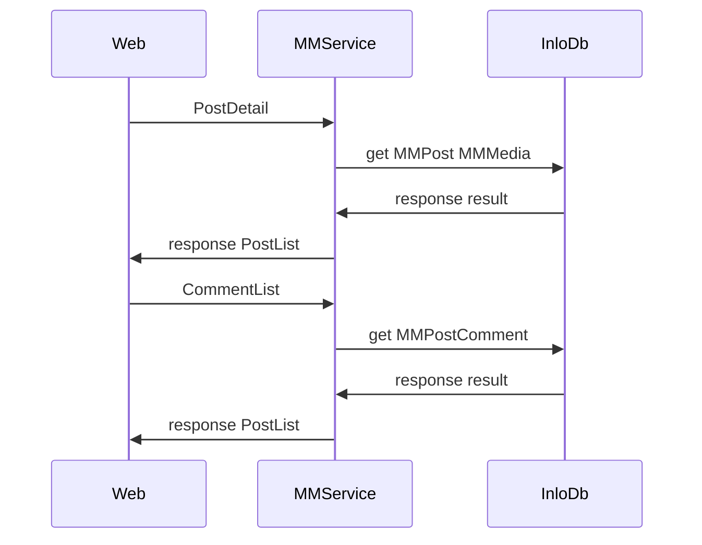
<div style="break-after: page; page-break-after: always;"></div>

## 發布帖子(評論、舉報)

在提交帖子(評論、舉報)前會把使用者要上傳的圖檔暫存在網頁上，直到使用者點擊發布時才會將圖片透過 Media\Create 上傳到後端，後端在把對應的資料提交到雲倉儲以及資料庫 MMMedia 內，並回傳新產生(或是編輯)的編號。

在處理完媒體資料的上傳後前端會提交帖子(評論、舉報)這時會將產生的帖子(評論、舉報)編號更新到 MMMedia 的 RefId 之中。

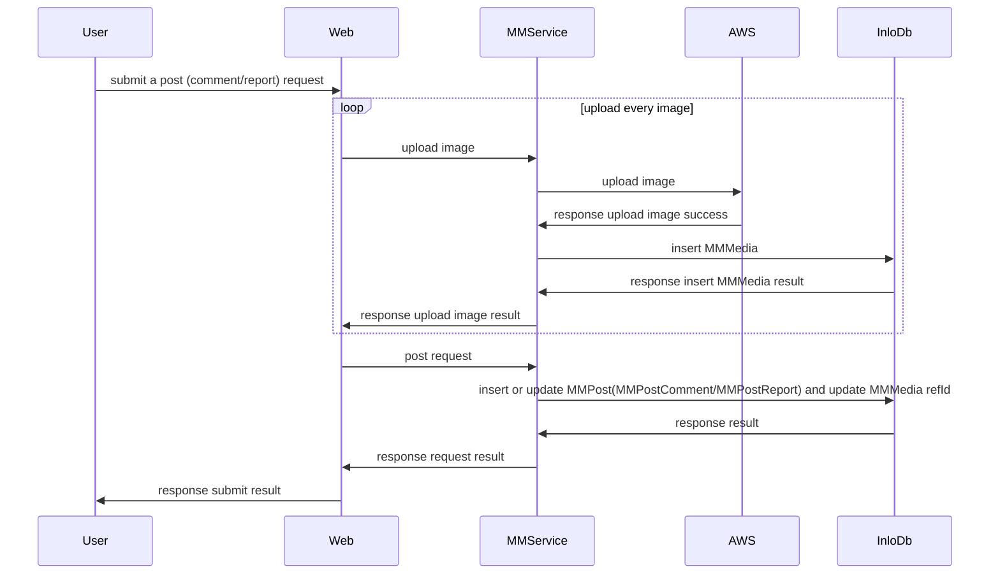
<div style="break-after: page; page-break-after: always;"></div>

## 覓錢包

在覓錢包內會去`01 Api`那邊取得使用者在秘色的錢包資訊，並且由`InloDb`內取得使用者營收會總資料。

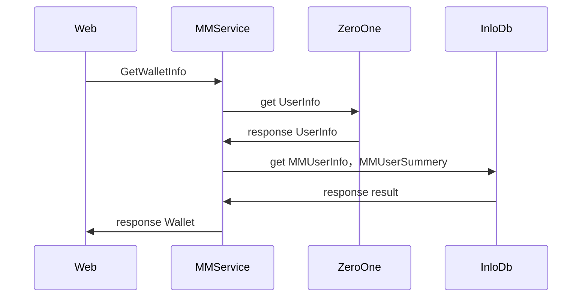


<div style="break-after: page; page-break-after: always;"></div>

## 收益明細

由`InloDb`內取得使用者收益、費用列表資訊。

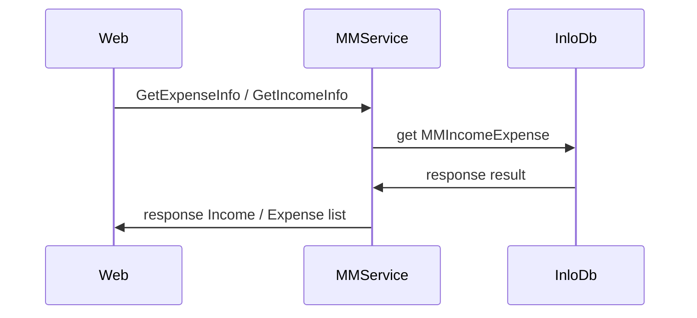


<div style="break-after: page; page-break-after: always;"></div>

## 官方訊息

由`InloDb`內取得官方訊息並呈現。

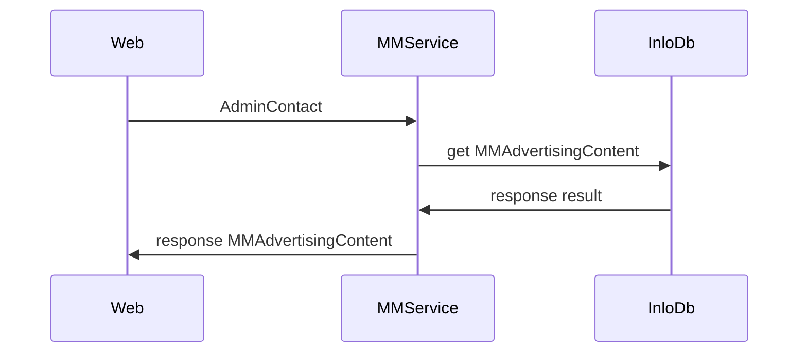


<div style="break-after: page; page-break-after: always;"></div>


# 類別關係圖

## 帖子相關資料庫的關係


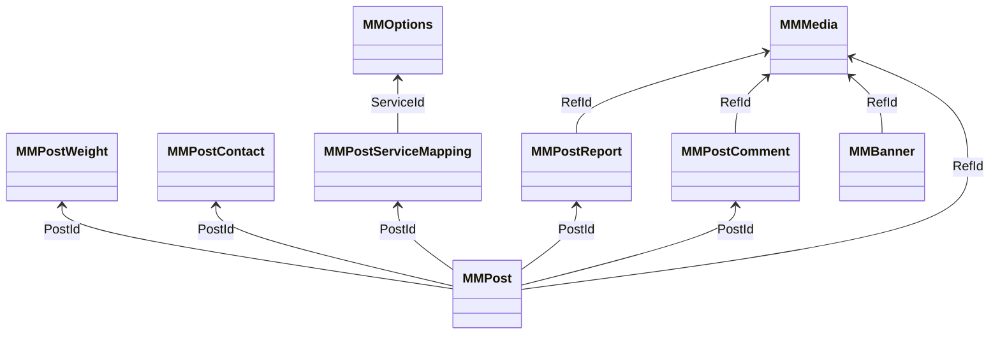


<div style="break-after: page; page-break-after: always;"></div>

## 收益費用與會員卡相關資料庫的關係


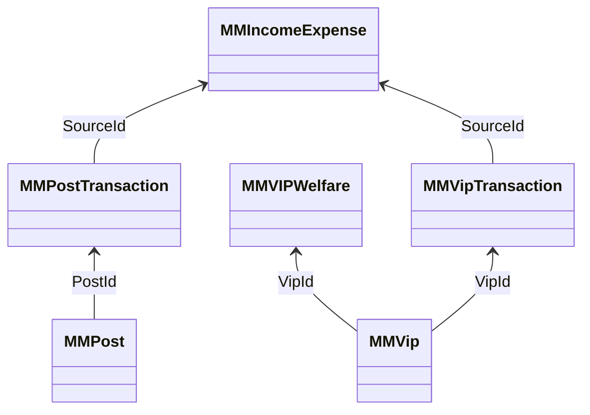


<div style="break-after: page; page-break-after: always;"></div>