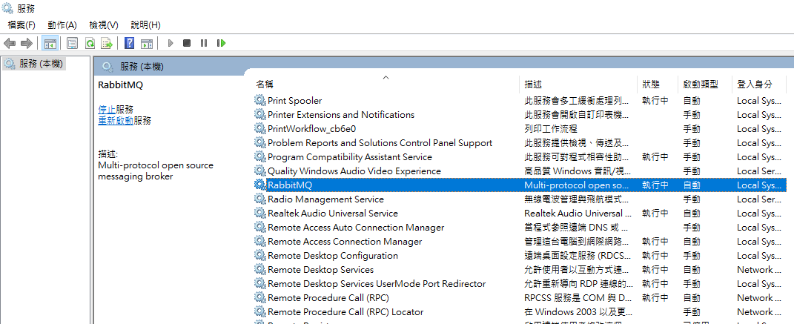

# RabbitMQ安裝設定


## 1. 下載並安裝檔案

> Erlang下載網址：https://www.erlang.org/downloads

> RabbitMQ下載網址：https://www.rabbitmq.com/download.html


##  2. RabbitMQ 插件設定

> 到 RabbitMQ 中的 sbin 資料夾，設置 RabbitMQ 的套件，
> 打開cmd，輸入以下指令
>
> 如果跳出錯誤訊息，表示你的 Erlang 安裝版本跟 RabbitMQ 要求的不一致，或是系統找不到 Erlang 執行檔

```jsx
開啟介面：rabbitmq-plugins enable rabbitmq_management
開啟STOMP協定：rabbitmq-plugins enable rabbitmq_stomp
開啟WEB STOMP協定：rabbitmq-plugins enable rabbitmq_web_stomp
```

> 執行以下指令會列出當前已安裝和啟用的 RabbitMQ 插件，
> 插件名稱前方有 [E*] 表示已被啟用，可以看到剛剛輸入的指令已經是啟用狀態

```jsx
rabbitmq-plugins list
```


> 完成設置後，即可重啟 RabbitMQ Server




## 3. 登入RabbitMQ介面

> 啟動 RabbitMQ Server 之後，打開瀏覽器，輸入 [http://localhost:15672](http://localhost:15672/) 即可看到登入畫面，帳密可輸入 guest 
> (guest為 RabbitMQ 預設帳號)
>
> 完成登入後，就可以看到 RabbitMQ 的管理介面


## 4. 加入帳號與權限設定

> 至Admin頁面可以加入帳號並選擇admin權限，需確保程式中的appsettings.json MQ帳號密碼與MQ伺服器設定的帳號密碼相同，才能保證連接和通訊成功


> 新增user時選了Admin權限但Can access virtual hosts還是沒有開啟，
> 這樣客戶端會無法通過 STOMP 協定與 RabbitMQ 進行通訊

> 點選帳號後進入調整權限的畫面


> 進入頁面後點擊Set permission後即可開啟權限


> Can access virtual hosts欄位值為斜線即為成功開啟權限


## 5. 加入Exchange

> 程式中發送與監聽的Exchange的設定名稱需與MQ Exchange名稱設定一致，以確保正確的消息路由
>
> 目前秘色後台專案有使用HECBET_CLIENTS_WITH_WCF


> 後台ts使用Exchange範例


> 後端程式使用Exchange範例

