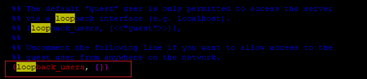

# Linux RabbitMQ服務佈署


# 安裝檔案

> RabbitMQ是用Erlang語言編寫的，首先需要安装Erlang。
> 

```jsx
sudo yum install epel-release
sudo yum install erlang
```

> 安裝wget
> 

```jsx
sudo yum install wget gcc
```

> 下載RabbitMQ
> 

```jsx
wget https://github.com/rabbitmq/rabbitmq-server/releases/download/rabbitmq_v3_6_12/rabbitmq-server-3.6.12-1.el7.noarch.rpm
```

> 安裝RabbitMQ
> 

```jsx
sudo rpm -Uvh rabbitmq-server-3.6.12-1.el7.noarch.rpm

# 如果提示如下
warning: rabbitmq-server-3.6.12-1.el7.noarch.rpm: Header V4 RSA/SHA1 Signature, 
key ID 6026dfca: NOKEY
error: Failed dependencies:
  socat is needed by rabbitmq-server-3.6.12-1.el7.noarch

# 需先安装 socat
sudo yum install socat
```

# 啟動RabbitMQ

- 啟動RabbitMQ服務

```jsx
sudo systemctl start rabbitmq-server
```

- 確認RabbitMQ服務狀態

```jsx
sudo systemctl status rabbitmq-server
```

- 設定開機時啟動服務

```jsx
sudo systemctl enable rabbitmq-server
```

- 設定開啟網頁插件與stomp

```jsx
sudo rabbitmq-plugins enable rabbitmq_management
sudo rabbitmq-plugins enable rabbitmq_stomp
sudo rabbitmq-plugins enable rabbitmq_web_stomp
```

> 啟動相關指令
> 

```jsx
啟動服務：sudo systemctl start rabbitmq-server
停止服務：sudo systemctl stop rabbitmq-server
重啟服務：sudo systemctl restart rabbitmq-server
查看服務狀態：sudo systemctl status rabbitmq-server
設置服務開機時啟動：sudo systemctl enable rabbitmq-server
取消服務開機時啟動：sudo systemctl disable rabbitmq-server
```

## 預設的用戶(帳號密碼都是guest)，只能登入localhost

- 複製範例的設定檔到目前執行的專案下

```jsx
sudo cp /usr/share/doc/rabbitmq-server-3.6.12/rabbitmq.config.example /etc/rabbitmq/rabbitmq.config
```

- vim編輯設定檔，移除註解(使遠端可以用guest登入)

```jsx
# 編輯設定檔
sudo vim /etc/rabbitmq/rabbitmq.config

# 移除原本的註解
{loopback_users, []}
```



- 調整完後重啟RabbitMQ，遠端即可使用Guest登入，登入後再上去做帳戶的設定即可

# 開啟防火牆

```jsx
sudo firewall-cmd --zone=public --add-port=5672/tcp --permanent
sudo firewall-cmd --zone=public --add-port=15672/tcp --permanent
sudo firewall-cmd --zone=public --add-port=5674/tcp --permanent
sudo firewall-cmd --zone=public --add-port=15674/tcp --permanent
sudo firewall-cmd --reload
```