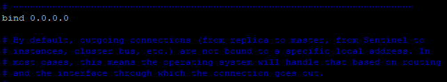
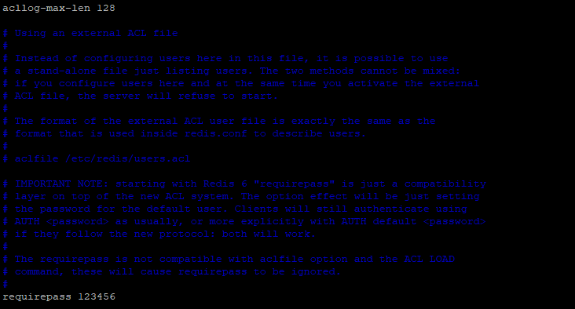

# Linux Redis服務佈署

# 安裝Redis

```jsx
sudo yum install http://rpms.remirepo.net/enterprise/remi-release-7.rpm
sudo yum install --enablerepo=remi install redis
```

# 修改redis.conf檔

- 此命令須先安裝vim

```jsx
sudo vim /etc/redis/redis.conf
```

進入redis.conf後，需調整為

```jsx
bind 0.0.0.0
requirepass 123456
```

> 調整bind選項(表示所有主機都可以連到redis)
> 



> 調整requirepass選項(預設requirepass是註解的，較難尋找，大概位置在acllog-max-len下方)
> 

> (123456為連線時的密碼，可以根據實際需求調整)
> 




# 啟動Redis

- 啟動Redis服務

```jsx
sudo systemctl start redis.service
```

- 確認Redis服務狀態

```jsx
sudo systemctl status redis.service
```

- 設定開機時啟動服務

```jsx
sudo systemctl enable redis.service
```

> 啟動相關指令
> 

```jsx
啟動服務：sudo systemctl start redis.service
停止服務：sudo systemctl stop redis.service
重啟服務：sudo systemctl restart redis.service
查看服務狀態：sudo systemctl status redis.service
設置服務開機時啟動：sudo systemctl enable redis.service
取消服務開機時啟動：sudo systemctl disable redis.service
```

# 開啟防火牆

```jsx
sudo firewall-cmd --zone=public --add-port=6379/tcp --permanent
sudo firewall-cmd --reload
```