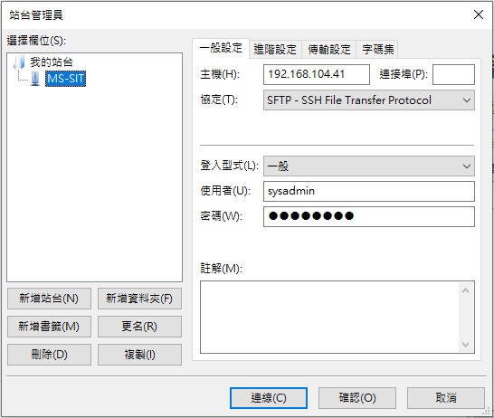
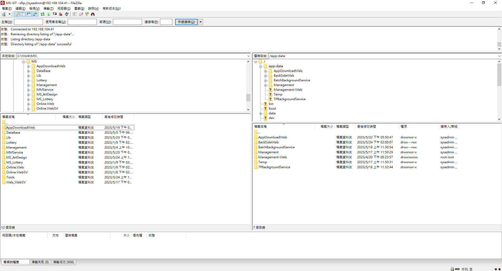
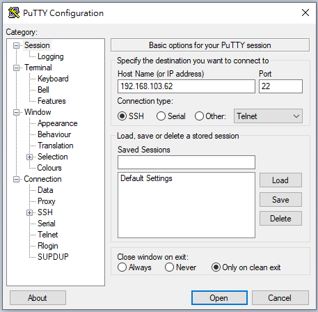
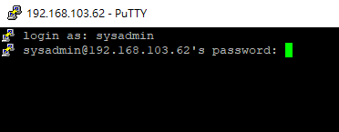
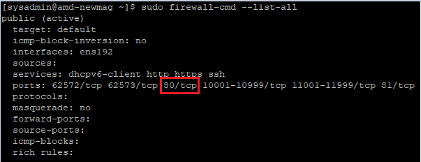

# Linux Web站台佈署

# local檔案上傳到Server(SFTP

> **開啟FileZilla後點選 檔案 ⇒ 站台管理員 ⇒ 參照以下圖片設定 ⇒ 連線**
> 



> **上傳下載**
- 完成設定後即可手動拖拉檔案上傳下載
- web站台放在/app-data底下



# 使用putty登入站台

- 圖中範例為UAT環境IP，按照圖中設定開啟連線
- SIT IP：192.168.104.41
- UAT IP：192.168.103.62



- 開啟連線後輸入登入帳號及密碼

- SIT/UAT 帳號：sysadmin   密碼：!QAZ2wsx

  

# 架設站台設定

> **使用vim新增&編輯BackSideWeb.conf設定**
- 該設定主要可以透過Nginx做反向代理，提供安全性層、紀錄Log、SSL/TLS 加密等
- vim為linux中文字編輯器，可透過以下指令新增&編輯文件，下面為BackSideWeb專案範例

```jsx
sudo vim /etc/nginx/conf.d/BackSideWeb.conf
```

- 下面為BackSideWeb.conf範例，請依照實際來設定
- 此設定檔意思為監聽這台的 80 port，將request反代到 http://localhost:5148，並記錄log到指定位置

```jsx
server {
    listen       80;
    server_name  _;

    access_log  /data/logs/nginx/access/BackSideWeb.log main;

    location / {
        proxy_pass         http://localhost:5148;
        proxy_http_version 1.1;
        proxy_set_header   Upgrade $http_upgrade;
        proxy_set_header   Connection keep-alive;
        proxy_set_header   Host $host;
        proxy_cache_bypass $http_upgrade;
		
		#下面兩個設定根據情況選擇是否加上，加了此設定nginx會多拋送Header,使Web Conrtoller抓到對應的IP
		proxy_set_header   X-Real-IP $remote_addr;
		proxy_set_header   X-Forwarded-For $proxy_add_x_forwarded_for;
    }
}
```

> **驗證nginx正確性**
> 
- 如果配置檔案有語法錯誤，這個指令會顯示相關的錯誤訊息
- 如果配置檔案沒有問題，則會顯示 "configuration file syntax is ok" 的訊息

```jsx
sudo nginx -t
```

> **重新加載nginx**
> 
- 驗證正確性後重新載入新的設定

```jsx
sudo nginx -s reload
```

> **啟動nginx**
> 
- 同最下面的服務啟動相關指令

```jsx
sudo systemctl start nginx
```

> **使用vim新增編輯BackSideWeb.service**
> 

```jsx
sudo vim /etc/systemd/system/BackSideWeb.service
```

- 用來定義該站台的服務配置
- 此為BackSideWeb.service範例，請依照實際檔案位置、服務名稱與環境變數來設定

```jsx
[Unit]
# Description=<此服務的摘要說明>
Description=BackSideWeb

[Service]
# WorkingDirectory=<ASP.NET Core 專案目錄>
WorkingDirectory=/app-data/BackSideWeb

# ExecStart=/bin/dotnet <ASP.NET Core 起始 dll>
ExecStart=/bin/dotnet /app-data/BackSideWeb/BackSideWeb.dll --urls http://*:5148

# 啟動若失敗，就重啟到成功為止
Restart=always

# 重啟的間隔秒數
RestartSec=10

# 設定環境變數，注入給 ASP.NET Core 用
Environment=DOTNET_PRINT_TELEMETRY_MESSAGE=false
Environment=ASPNETCORE_ENVIRONMENT=SIT

[Install]
WantedBy=multi-user.target
```

- 編輯完成後，左下輸入`:wq!`，保存退出

> 重新加載**BackSideWeb.service設定**
> 

```jsx
sudo systemctl daemon-reload
```

# 防火牆設定

> 開啟防火牆監聽
> 
- 以下是設定防火牆規則的指令，將指定的 **`<port>`**（請用實際的埠號替代）以 TCP 協議的方式添加到公共區域，否則外部無法訪問

```jsx
sudo firewall-cmd --zone=public --add-port=<port>/tcp --permanent
```

> 重新載入防火牆設定
> 
- 執行以下指令才能使新的規則生效

```jsx
sudo firewall-cmd --reload
```

> 確認防火牆開啟狀態
> 

```jsx
sudo firewall-cmd --list-all
```

- 拿此文件設定的80port為例，若有設定成功會顯示”80/tcp”



# 服務啟動相關指令

```jsx
啟動服務：sudo systemctl start BackSideWeb.service
停止服務：sudo systemctl stop BackSideWeb.service
重啟服務：sudo systemctl restart BackSideWeb.service
查看服務狀態：sudo systemctl status BackSideWeb.service
設置服務開機時啟動：sudo systemctl enable BackSideWeb.service
取消服務開機時啟動：sudo systemctl disable BackSideWeb.service
```