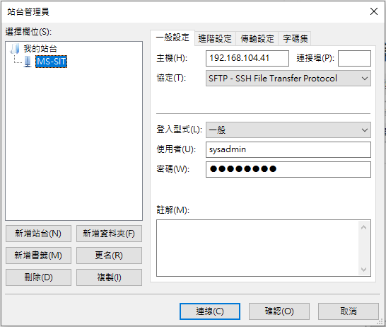

# Linux 排程服務佈署

# local檔案上傳到Server(SFTP

> **開啟FileZilla後點選 檔案 ⇒ 站台管理員 ⇒ 參照以下圖片設定 ⇒ 連線**
> 



> **上傳下載**
> 
- 完成設定後即可手動拖拉檔案上傳下載
- web站台放在/app-data底下


# 使用putty登入站台

- 圖中範例為UAT環境IP，按照圖中設定開啟連線
- SIT IP：192.168.104.41
- UAT IP：192.168.103.62


- 開啟連線後輸入登入帳號及密碼

- SIT/UAT 帳號：sysadmin   密碼：!QAZ2wsx

  

# 架設站台設定

> **使用vim新增編輯 排程名稱.service**
> 
- 來定義該站台的服務配置，以下以BatchBackgroundService.service做範例

```jsx
sudo vim /etc/systemd/system/BatchBackgroundService.service
```

- 請依照實際檔案位置、服務名稱與環境變數來設定

```jsx
#your service description
[Unit]
Description=BatchBackgroundService

#your console app path
[Service]
ExecStart=/bin/dotnet /app-data/BatchBackgroundService/BatchService.dll
WorkingDirectory=/app-data/BatchBackgroundService
Restart=always
RestartSec=10
Environment=DOTNET_ENVIRONMENT=SIT

[Install]
WantedBy=default.target
```

- 編輯完成後，左下輸入`:wq!`，保存退出

> **重新加載BatchBackgroundService.service設定**
> 

```jsx
sudo systemctl daemon-reload
```

# 服務啟動相關指令

```jsx
啟動服務：sudo systemctl start BatchBackgroundService.service
停止服務：sudo systemctl stop BatchBackgroundService.service
重啟服務：sudo systemctl restart BatchBackgroundService.service
查看服務狀態：sudo systemctl status BatchBackgroundService.service
設置服務開機時啟動：sudo systemctl enable BatchBackgroundService.service
取消服務開機時啟動：sudo systemctl disable BatchBackgroundService.service
```