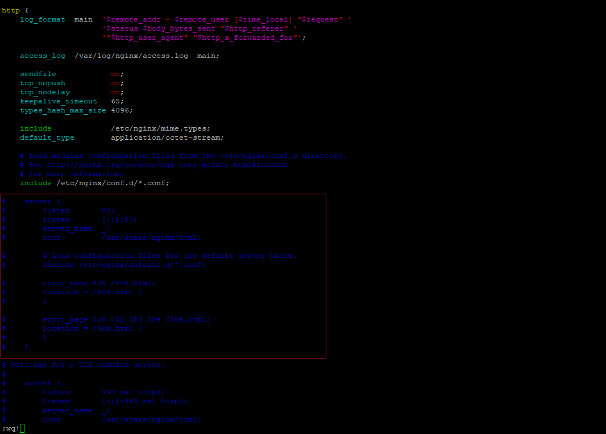
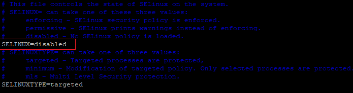

# 初次搭建系統設定

- 以下為第一次進入該機器要做的系統設定，若該機器已建置過其他服務則可以忽略本文件

- 可以先下載putty.exe(比CMD好操作，下載最新版即可)

# 基本linux語法

> **显示工作目录**

```jsx
pwd
```

> **切換當前工作目錄，driName表示法可為絕對路徑或相對路徑**
> 

```jsx
cd [dirName]
```

```jsx
EX:cd /usr/bin
```

> **創建目錄**
> 

```jsx
mkdir [dirName]
```

> **顯示指定工作目錄下之內容**
> 

```jsx
ls [dirName]
```

> **編輯vim(文字編輯器)**
> 

```jsx
vim [fileName]
```

- 一進入vim後會在命令模式，這時按下`Insert/i/a`字符，即可進入輸入模式
- 輸入模式完成後按下ESC回到命令模式，輸入指令`:wq!`，強制保存退出
- 輸入模式完成後按下ESC回到命令模式，輸入指令`:q!`，強制不保存退出

# local檔案上傳到Server(SFTP)

- 可以使用CMD執行

> **登入**
> 

```jsx
sftp sysadmin@192.168.104.41
```

> **輸入密碼**
> 

```jsx
!QAZ2wsx
```

> **先切換到要上傳檔案的資料夾**
> 

```jsx
cd [dirName]
```

> **上傳檔案**
> 

```jsx
put -r [local publish dir]
```

```jsx
EX:put -r c:\publish
```

# 安裝需要的套件

> **安裝 .NET Core Runtime**
> 

```jsx
sudo rpm -Uvh https://packages.microsoft.com/config/rhel/7/packages-microsoft-prod.rpm
sudo yum install aspnetcore-runtime-6.0
```

> **安裝Nginx**
> 

```jsx
sudo yum install epel-release
sudo yum install nginx
```

> **安裝vim(文字編輯器)**
> 

```jsx
sudo yum install vim
```

# 設定**Nginx檔案**

> **使用vim編輯Nginx的預設檔案 註解Server段落**
> 

```jsx
sudo vim /etc/nginx/nginx.conf
```



- 此檔案為nginx預設設定檔(預設404 50x的錯誤頁面位置)，因此將server段落註解或移除(根據 `include /etc/nginx/conf.d/*.conf;`，nginx會吃到此位置下其他檔案的設定)
- 編輯完成後，左下輸入`:wq!`，保存退出

# 修改SELinux檔

> 修改此檔案，避免某些權限的問題
> 

```jsx
sudo vim /etc/selinux/config
```

>進入config後，需調整為
>

```jsx
SELINUX=disabled
```



> 修改完後重啟
>

```jsx
sudo reboot
```