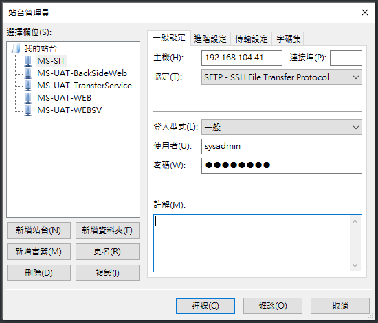

# 專案位置與站台連線資訊

---

## 專案名稱（用途）

### Web_WebSV （前台Web站台）

TFS Git版控：[Web_WebSV](https://tfs2017/DefaultCollection/MS_Lottery/_git/Web_WebSV)

Web站台專案路徑

`\Web_WebSV\Web\Web.Core.sln`

Web Service站台專案路徑

`\Web_WebSV\WebSV\SLPolyGame.Web.Core.sln`

##

### Management （管理後台站台）

TFS Git版控：[Management](https://tfs2017/DefaultCollection/MS_Lottery/_git/Management)

後台專案路徑

`\Management\BackSideWe\BackSideWeb.sln`

##

### Lib （共用Service庫）

TFS Git版控：[Lib](https://tfs2017/DefaultCollection/MS_Lottery/_git/Lib)

通常會直接參考在各服務中的Service中

##

### Tools （排程）

TFS Git版控：[Tools](https://tfs2017/DefaultCollection/MS_Lottery/_git/Tools)

xxxxBackgroundService 為第三方界接排程（xxxx通常為第三方遊戲之英文縮寫）

第三方排程路徑

`\Tools\所有第三方BackgroundService\xxxxBackgroundService\xxxxBackgroundService.sln`

BatchService排程路徑

`\Tools\BatchBackgroundService\BatchBackgroundService.sln`

##

### DataBase （資料庫相關語法版控）

TFS Git版控：[DataBase](https://tfs2017/DefaultCollection/MS_Lottery/_git/DataBase)

所有資料庫相關的SQL語法

`\DataBase\MS-Inlodb_all.sln`

開啟上述的專案後，開啟以下工具檔案來比對異動後的SQL，並且完成合併動作，再透過Git工具將異動推入版控

`\DataBase\Inlodb\Inlodb.sln`

`\DataBase\Inlodb_bak\Inlodb_bak.sln`

##

**AppDownloadWeb (App下載頁)**

TFS Git版控：[AppDownloadWeb](https://tfs2017/DefaultCollection/MS_Lottery/_git/AppDownloadWeb)

下載頁專案路徑

`\AppDownloadWeb\AppDownloadWeb.sln`

##

### MS_Lottery （所有系統環境之相關文件）

TFS Git版控：[MS_Lottery](https://tfs2017/DefaultCollection/_git/MS_Lottery)

與MS系統相關的文件或工具可由此處查找

---

## Linux佈署環境登入及IP位置

### FileZilla登入Linux環境操作簡介

> FileZilla安裝檔可至JXTools取得
> 開啟FileZilla後至 檔案 ⇒ 匯入該設定檔 [MS_Linux_Info.xml](MS_Linux_Info.xml) 
> 匯入成功後至 檔案 ⇒ 站台管理員 即可看見各站台IP與帳密設定即可連線登入

### 登入環境相關說明

- SIT環境登入資訊

  SIT環境為開發人員自行控管，由於SIT環境相關流水線均已建立完成，故非特殊情況不需要連線至主機內進行調整，應透過Jenkins自動部屬即可

  帳號：sysadmin  

  密碼：!QAZ2wsx

- UAT環境登入資訊

  UAT環境由SRE部門控管，連線主要是查看主機狀態與設定檔是否正常，有任何伺服器操作需求須透過SRE來執行

  帳號：sysadmin

  密碼：!QAZ2wsx

### SIT環境機器IP位置

WEB

`192.168.104.41`

WEBSV 

`192.168.104.41`

BackSideWeb 

`192.168.104.41`

排程 

`192.168.104.41`

AppDownloadWeb

`192.168.104.41`

### UAT環境機器IP位置

WEB 

`192.168.103.66`

WEBSV 

`192.168.103.65`

BackSideWeb 

`192.168.103.62`

排程 

`192.168.103.64`

AppDownloadWeb (未知 由SRE控管)

---

## 各站台Domain網址

### SIT環境

[前台](http://192.168.104.41:83/?userId=3&userName=%E5%A4%A9%E5%AD%97%E7%AC%AC%E4%B8%89%E8%99%9F&roomNo=10093&clientWebPageValue=GameCenter&depositUrl=https%3A%2F%2Fwww.baidu.com%3Ftoken%3Dxxxxxx&IsDebugger=true)

[後台](http://192.168.104.41)

[下載頁](http://192.168.104.41:81)

[WEBSV-Swagger](http://192.168.103.65:18062/swagger/index.html)

### UAT環境

[前台](https://ms-lottory-web.ioiskp.com/?userId=1&userName=%E7%99%BD%E8%89%B2%E6%83%85%E4%BA%BA%E7%AF%80&roomNo=10093&clientWebPageValue=GameCenter&depositUrl=https%3A%2F%2Fwww.baidu.com%3Ftoken%3Dxxxxxx&IsDebugger=true)

[後台](https://ms-lottory-backsideweb.ioiskp.com)

[下載頁](http://appdownload.luoznz.com)

[WEBSV-Swagger](http://192.168.104.41:82/swagger/index.html)

---

## Jenkins

http://192.168.4.60:9090

帳密需自行申請

---

## Kibana  Log查詢網站

[UAT](http://elk.sys.ark88.net/)

[LIVE](http://amdelk.im00.com:45601/app/kibana#/home?_g=())

帳號：dev-rd
密碼：5tgb^YHN

---

## Redis站台IP

### DEV/SIT環境 (共用)

IP：192.168.104.69

Port：6379

密碼：123456

### UAT環境

IP：192.168.103.40

Port：6379

密碼：123456

---

